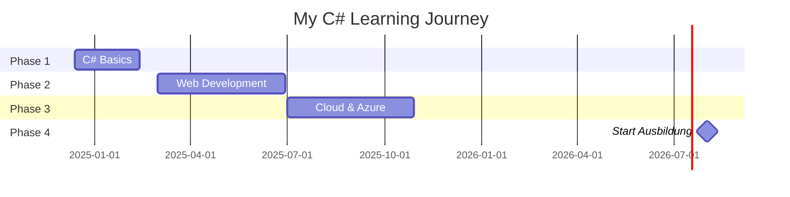

<div align="center">

# 🚀 C# Basics - My Coding Journey

### *From Zero to Hero in 10 Weeks*


</div>

---

## 🎯 Mission

Mastering C# fundamentals to **dominate** my IT Ausbildung at **Cargonerds** starting August 2026.

Currently **16 years old**, building the foundation for my tech career in Hamburg, Germany 🇩🇪

---

## 📚 Learning Roadmap
```
Phase 1: Foundation Building
├── ✅ Setup Development Environment
├── 🔄 Variables & Data Types (Week 1)
├── ⏳ Operators & Logic (Week 2)
├── ⏳ Loops & Iteration (Week 3)
├── ⏳ Methods & Functions (Week 4)
├── ⏳ Arrays & Collections (Week 5-6)
├── ⏳ Object-Oriented Programming (Week 7-8)
├── ⏳ File I/O & Exceptions (Week 8-9)
└── ⏳ Final Project - Contact Manager (Week 10)
```

---

## 🛠️ Tech Stack

| Category | Tools |
|----------|-------|
| **Language** | C# 12 |
| **Framework** | .NET 8 |
| **IDE** | Visual Studio Code |
| **Version Control** | Git & GitHub |
| **Learning Source** | Microsoft Learn |

---

## 🎮 Projects Showcase

<table>
  <tr>
    <td align="center" width="33%">
      
      <br><b>Calculator</b>
      <br><sub>Week 2</sub>
      <br>⏳ Coming Soon
    </td>
    <td align="center" width="33%">
      
      <br><b>Number Guessing Game</b>
      <br><sub>Week 3</sub>
      <br>⏳ Coming Soon
    </td>
    <td align="center" width="33%">
      
      <br><b>Temperature Converter</b>
      <br><sub>Week 4</sub>
      <br>⏳ Coming Soon
    </td>
  </tr>
  <tr>
    <td align="center" width="33%">
      
      <br><b>To-Do List App</b>
      <br><sub>Week 6</sub>
      <br>⏳ Coming Soon
    </td>
    <td align="center" width="33%">
      
      <br><b>Bank Account System</b>
      <br><sub>Week 7</sub>
      <br>⏳ Coming Soon
    </td>
    <td align="center" width="33%">
      
      <br><b>Contact Manager</b>
      <br><sub>Week 10 - Final</sub>
      <br>⏳ Coming Soon
    </td>
  </tr>
</table>

---

## 📊 Learning Stats
```text
⏰ Total Study Time       : 8 / 120 hours
📝 Topics Completed       : 1 / 12
🎯 Projects Built         : 0 / 7
🔥 Current Streak         : 1 day
📅 Days Until Ausbildung  : 597 days
```

---

## 🏆 Skills Progress

<table>
  <tr>
    <td><b>Variables & Types</b></td>
    <td>⭐⭐⚪⚪⚪</td>
    <td>40%</td>
  </tr>
  <tr>
    <td><b>Control Flow</b></td>
    <td>⚪⚪⚪⚪⚪</td>
    <td>0%</td>
  </tr>
  <tr>
    <td><b>Loops</b></td>
    <td>⚪⚪⚪⚪⚪</td>
    <td>0%</td>
  </tr>
  <tr>
    <td><b>Methods</b></td>
    <td>⚪⚪⚪⚪⚪</td>
    <td>0%</td>
  </tr>
  <tr>
    <td><b>OOP Concepts</b></td>
    <td>⚪⚪⚪⚪⚪</td>
    <td>0%</td>
  </tr>
  <tr>
    <td><b>File I/O</b></td>
    <td>⚪⚪⚪⚪⚪</td>
    <td>0%</td>
  </tr>
</table>

---

## 📆 Weekly Updates

### Week 1 (Dec 13-19, 2024) 🔄 IN PROGRESS
- ✅ Installed Visual Studio Code
- ✅ Installed .NET SDK
- ✅ Created GitHub account
- 🔄 Learning Variables & Data Types
- 📖 Microsoft Learn: Module 1-2

### Week 2 (Dec 20-26)
⏳ Starting soon...

---

## 🎓 Learning Resources

- 📚 [Microsoft Learn - C# Path](https://learn.microsoft.com/training/paths/csharp-first-steps/)
- 🎥 [freeCodeCamp C# Course](https://www.youtube.com/freecodecamp)
- 📖 [C# Documentation](https://learn.microsoft.com/dotnet/csharp/)

---

## 🎯 Goals Timeline


---

## 💪 Why I'm Doing This

> *"Most 16-year-olds are still figuring out what they want to do. I'm already building the skills for my future. By the time I start my Ausbildung, I won't just be learning - I'll be leading."*

**Future Goals:**
- 🎯 Excel at Cargonerds Ausbildung
- 💼 Become a senior developer by 25
- 🌍 Build tech solutions for Africa
- 💰 Financial freedom by 30

---

## 📫 Connect

[](https://github.com/sylvester-thdy)

---

<div align="center">

### 🔥 *Lock In Mode: Activated* 🔥

**Last Updated:** December 13, 2024


</div>
